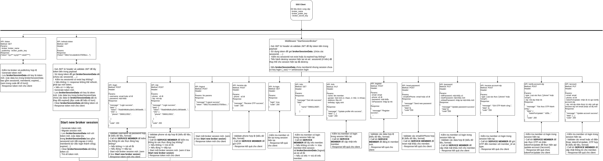

# WORKFLOW CLIENT

# WORKFLOW SERVER

# WORKFLOW UPDATE ACCOUNT

# NOTE
Open file [này](files/workflow_sso.drawio) trên trang
[draw.io](https://app.diagrams.net/) để chỉnh sửa workflow nếu có thay đổi
